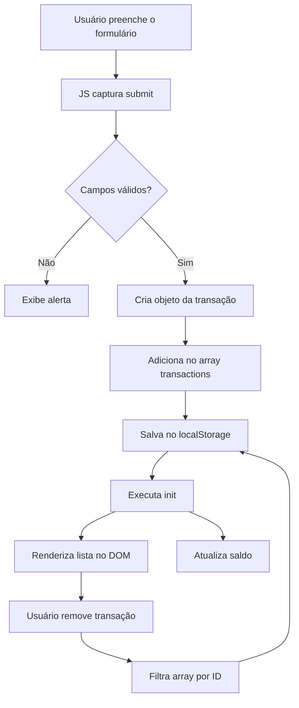
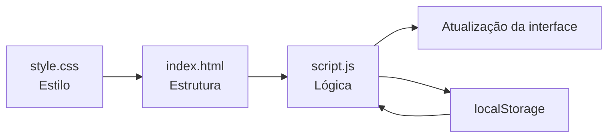

# 💰 Gasto Certo

Aplicação web simples de controle financeiro desenvolvida com **HTML, CSS e JavaScript puro**.

Este projeto foi criado com foco em aprendizado prático, explorando conceitos fundamentais do JavaScript sem uso de frameworks, com manipulação direta do DOM e persistência de dados via `localStorage`.

---

## 🌐 Deploy

👉 https://soeirotech-lab.github.io/Gasto-Certo/

## 🚀 Funcionalidades

* ✅ Adicionar receitas e despesas
* ✅ Remover transações
* ✅ Cálculo automático de:

  * Saldo total
  * Total de receitas
  * Total de despesas
* ✅ Persistência de dados no navegador (`localStorage`)
* ✅ Interface responsiva e organizada em cards

---

## 🧠 Conceitos praticados

* Manipulação de DOM (`querySelector`, `createElement`, `innerHTML`)
* Eventos (`addEventListener`, `submit`)
* Estruturas de dados (array de objetos)
* Métodos de array:

  * `map`
  * `filter`
  * `reduce`
* Armazenamento local (`localStorage`)
* Organização de código em funções reutilizáveis
* Separação de responsabilidades (HTML, CSS, JS)

---

## 📂 Estrutura do projeto

```bash
.
├── index.html
├── style.css
└── script.js
```

---

## 🧭 Fluxo da aplicação



---

## 🏗️ Arquitetura simples



---

## ▶️ Como executar

1. Clone o repositório:

```bash
git clone https://github.com/seu-user/gasto-certo.git
```

2. Acesse a pasta:

```bash
cd gasto-certo
```

3. Abra o arquivo no navegador:

```bash
index.html
```

---

## 📸 Preview

> Adicione aqui uma imagem do projeto rodando (print da tela)

---

## 🎯 Objetivo do projeto

Este projeto faz parte da minha jornada de aprendizado em desenvolvimento web, com foco em dominar os fundamentos do JavaScript antes de avançar para frameworks e arquiteturas mais complexas.

---

## 📌 Roadmap de evolução

* [ ] Validação mais robusta de dados
* [ ] Edição de transações
* [ ] Filtro por tipo (receita/despesa)
* [ ] Melhorias de UI/UX
* [ ] Integração com API (backend)
* [ ] Autenticação de usuário

---

## 🧑‍💻 Autor

Desenvolvido por **SoeiroTech**

---

## 📄 Licença

Este projeto é de uso livre para fins de estudo.
